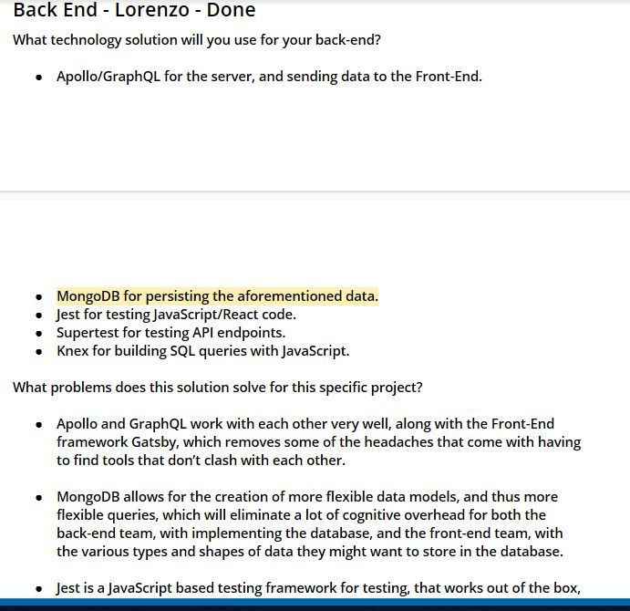
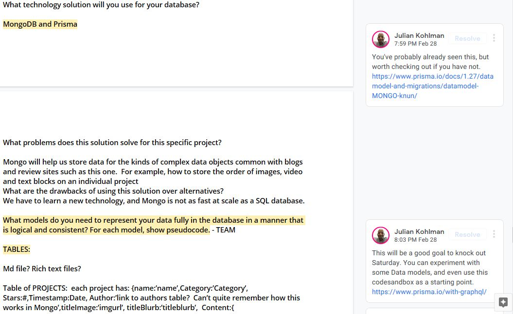

This is my first post on my new NOT fake blog! How exciting!

I don't have any merged PRs this week, as we only just got access to our github.  We were focused this week on finishing our TDD, finalizing our stack and 
beginning to familiarize ourselves with the stack. The main challenge revolved around deciding on the stack.  We had a proposed new stack which would consist of 
Gatsby on the front end, Apollo in the middle and Graph QL and PostGres SQL on the backend.  I was working on the schemas for our data, and was having a lot of difficulty
figuring out how to store the positions of items in the users description of their project.  There are text blocks, links and images all included, and the user arranges them
as they like with drag and drop and 'add' buttons.  Therefore, we need to store the position.  It was very difficult to figure out how to do this with SQL join tables, so we 
decided to switch to Mongo instead, where we can store all three kinds of data in an array together, with their array position serving as their order location. So our final proposed
new stack was Gatsby, Apollo, GraphQL and MongoDB, with an assist from Prisma which Julian says is a tool to make using these other resources easier.  However, some group members
voiced concerns about the new stack, since we would have to learn a lot of new technologies.  Personally, I am interested in the new technologies, but trepidatious about learning
them in the allotted time.  Our project leader FJ was also very concerned about this and emphasized that the user doesn't know what tech is used in the stack, they only care about
the experience.  Ultimately, we decided to go with the new stack because it will allow for greater flexibility in data querying, and with the complex data we have which is supposed
to be queried many different ways as users filter the display of projects, GraphQL and the technologies that work with it will be invaluable, since GraphQL allows the front end to query just the data they need in the way they want.  This speeds up the site and allows for the fast deployment of new features, both of which will directly impact the user experience.  My next task over the weekend is to clean up our schemas and start trying to put them into the Schema Definition Language that GraphQL relies upon.

Screenshots of TDD:

