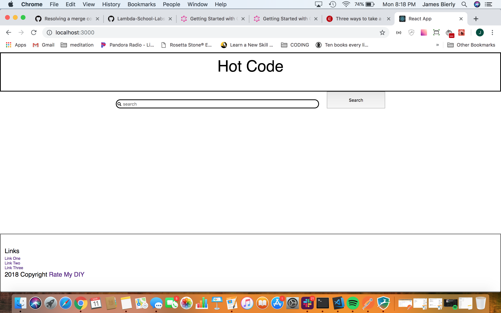

This week we worked at first on making schemas for graphQL.  Personally I made the first draft of these, then we talked through them on Saturday and reworked them to be in roughly the correct syntax.  We cleaned up the syntax more on Monday and wrote them all out in a file for use by the API.

I also worked on some of the components for the front end.  My main contribution this week was to make a search bar which would generate a log in box if the user was not logged in.  First I controlled the text for the search bar, then added an isLoggedIn property in local state, since we haven't set up state management for the system yet.  I was unable to make the close button or sign in work yet, because I will need app state for that, since the popup component needs to send state change 'up' a level back to the searchbar component in order to reset the isLoggedIn property and the popup display boolean as well.

[Link to front end pull](https://github.com/Lambda-School-Labs/labspt2-rate-my-diy/pull/12)
[Link to front end trello](https://trello.com/c/yILIZR27/36-components)

[Link to back end pull](https://github.com/Lambda-School-Labs/labspt2-rate-my-diy/commit/6183808462eef7dadf18c7ab43e873182a1ab3dd)
[Link to back end Trello](https://trello.com/c/bjizP7Jz/22-schema-define-schema-types)